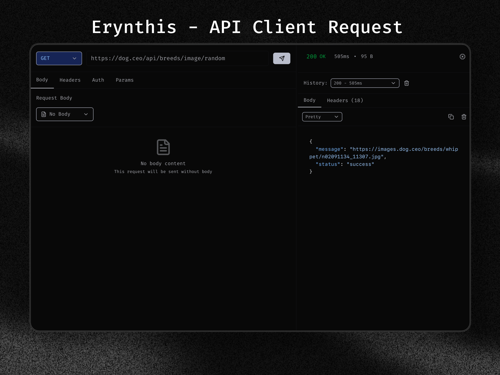

## `Erynthis` - API Client Request

<div align="center">



</div>

## Whats is Erynthis?

A modern, cross-platform API testing client built with Tauri, React, and TypeScript.

### Features

- **Fast & Lightweight** - Built with Tauri for optimal performance
- **HTTP Methods Support** - GET, POST, PUT, DELETE, PATCH, HEAD, OPTIONS and custom methods
- **Multiple Body Types** - Text, JSON, XML, YAML, Form Data (URL-encoded & Multipart), Binary
- **Modern UI** - Clean and intuitive interface built with React
- **Secure** - Rust backend ensures memory safety and security
- **Cross-Platform** - Windows, macOS, and Linux support
- **Real-time Response** - Instant request execution with response time tracking
- **Response Formatting** - Automatic JSON prettification and syntax highlighting

## Installation

1. **Clone the repository**
   ```bash
   git clone https://github.com/your-username/erynthis-api-client.git
   cd erynthis-api-client
   ```

2. **Install dependencies**
   ```bash
   npm install
   ```

3. **Run in development mode**
   ```bash
   npm run tauri dev
   ```

4. **Build for production**
   ```bash
   npm run tauri build
   ```

## License

[](LICENSE)